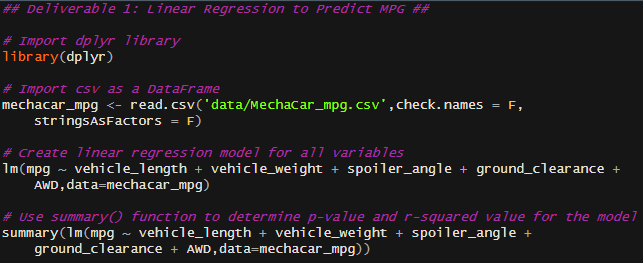
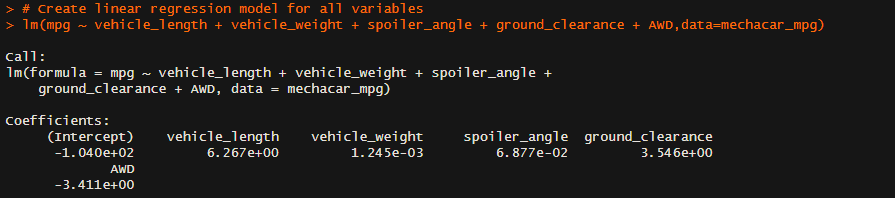
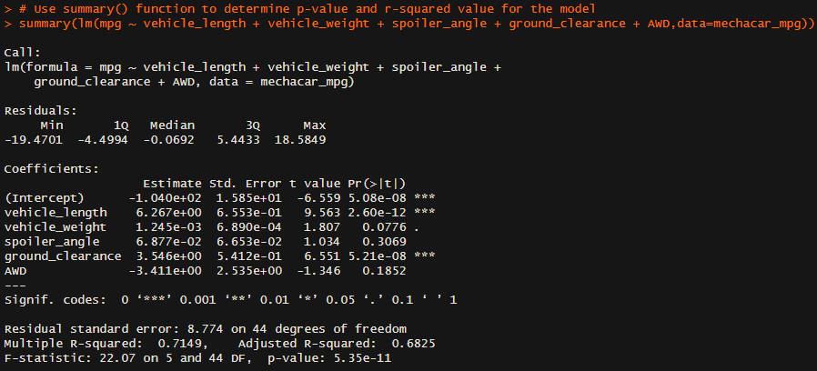
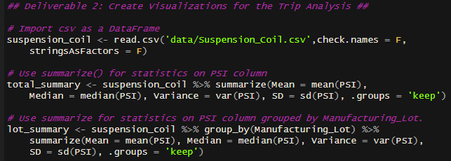
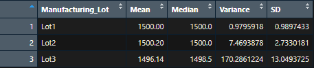
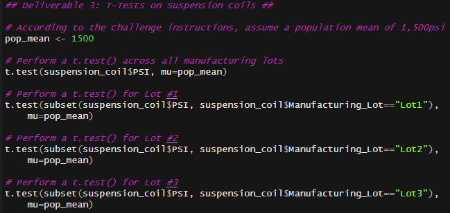
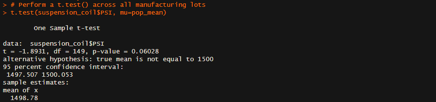
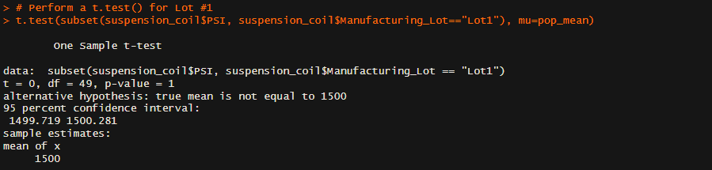
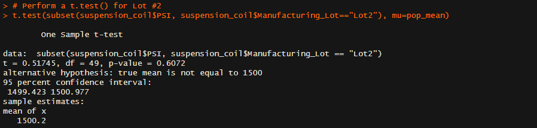
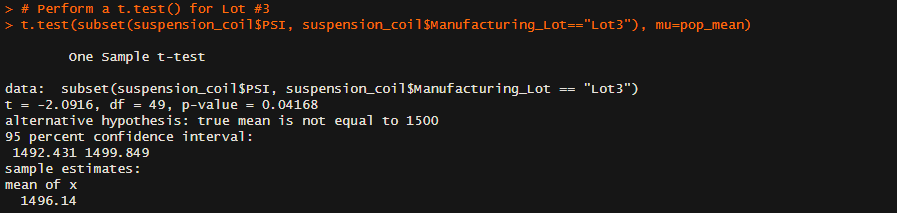

# AutosRUs with Statistics and R

## Overview of AutosRUs
In this module, Jeremy works for a company called AutosRUs. They want to update their decision-making abilities with improved data analytics of historial data and validation of current automotive specifications.

In this challenge assignment, AutosRUs has run into some production problems with their newest prototype, the MechaCar, which are blocking the manufacturing team's progress. The management would like to use data analytics to review the production data for any insights that might help the manufacturing team. The analytics team has the following goals and deliverables, as mentioned in the challenge assignment.

- **Deliverable 1: Linear Regression to Predict MPG**: Perform multiple linear regression analysis to identify which variables in the dataset predict the mpg of MechaCar prototypes.
- **Deliverable 2: Summary Statistics on Suspension Coils**: Collect summary statistics on the pounds per square inch (PSI) of the suspension coils from the manufacturing lots.
- **Deliverable 3: T-Test on Suspension Coils**: Run t-tests to determine if the manufacturing lots are statistically different from the mean population.
- **Deliverable 4: Design a Study Comparing the MechaCar to the Competition**: Design a statistical study to compare vehicle performance of the MechaCar vehicles against vehicles from other manufacturers.

## Resources
- MechaCar MPG Data: [MechaCar_mpg.csv](data/MechaCar_mpg.csv). Contains fuel efficiency (mpg) data for 50 prototype MechaCars, along with various factors potentially affecting the efficiency: vehicle length, vehicle weight, spoiler angle, drivetrain, and ground clearance.
- MechaCar Suspension Coil Data: [Suspension_Coil.csv](data/Suspension_Coil.csv). Contains the weight capacities of multiple suspension coils across various production lots to determine if the manufacturing process was consistent.
- Language(s): R 4.2.2
- Application(s): RStudio 2022.12.0
- R Script: [MechaCarChallenge.R](MechaCarChallenge.R)

## Deliverable 1: Linear Regression to Predict MPG

### Technical Analysis
The R script used to create the linear regression model can be found here:

### Written Summary
The results of the linear regression model can be found here:

**Which variables/coefficients provided a non-random amount of variance to the mpg values in the dataset?**

The linear model shows the following p-values for each of the tested variables:
- Vehicle Length: 2.6e-12
- Vehicle Weight: 0.078
- Spoiler Angle: 0.31
- Ground Clearance: 5.2e-8
- AWD: 0.19

Any variable with a p-test value less than 0.05 can be assumed to provide a non-random amount of variance to the mpg values (i.e. they are statistically significant). In this case, only the vehicle length and ground clearance meet this criteria.

Thus, vehicle weight, spoiler angle, and AWD provide a random amount of variance to the mpg values (i.e. they are not statistically significant).

**Is the slope of the linear model considered to be zero? Why or why not?**

If the null hypothesis were true, our linear model would have a slope of zero. The overall linear model has a p-value of 5.4e-11, which is much smaller than our 0.05 threshold. This means we can reject the null hypothesis. Therefore, the slope of our linear model is not considered to be zero.

**Does this linear model predict mpg of MechaCar prototypes effectively? Why or why not?**

The linear model has an R² value of 0.71, meaning it will correctly predict the mpg around 71% of the time. It gives better than 50/50 odds of correctly predicting the mpg, but not by much. Typically companies would want a much higher accuracy for their model to be of any real use.

## Deliverable 2: Summary Statistics on Suspension Coils

### Technical Analysis
The R script used to create summary statistics on the suspension coils (both across all lots and for individual lots) can be found here:

### Written Summary
The summary statistics across all manufacturing lots can be found here:

The summary statistics for each individual manufacturing lot can be found here:

**The design specifications for the MechaCar suspension coils dictate that the variance of the suspension coils must not exceed 100 pounds per square inch. Does the current manufacturing data meet this design specification for all manufacturing lots in total and each lot individually? Why or why not?**

The variance across all manufacturing lots is 62.3psi, which is high but still under the 100psi limit.

However, when broken down into individual lots, it can be seen that nearly all of the variance comes from Lot 3, which has a variance of 170.3psi. Lots 1 and 2 only have a variance of 1.0 and 7.5psi, respectively. Thus, Lot 3 had some sort of manufacturing issue that caused a lot of variable in those suspension coils. It should be closely examined to find out what went wrong.

## Deliverable 3: T-Test on Suspension Coils

### Technical Analysis
The R script to perform t-tests across all manufacturing lots and for each lot individually can be found here: 

### Written Summary
The t-test results across all manufacturing lots can be found here:

The t-test results for each manufacturing lot individually can be found here:

**Briefly summarize the interpretation and findings for the t-test results.**

A population mean of 1,500psi was assumed.

The t-test p-value across all lots is 0.06, which is higher than our 0.05 threshold. Thus, the mean across all lots (1498.8psi) is not statistically different from the population mean.

Similarly, the t-test p-values for Lots 1 and 2 individually are also higher than our 0.05 threshold (1.0 and 0.6, respectively). The means for Lots 1 and 2 (1,500.0 and 1,500.2psi, respectively) are not statistically different from the population mean.

However, the t-test p-value for Lot 3 is 0.04, which is lower than our 0.05 threshold. Therefore, we can state that the mean for Lot 3 (1,496.1 psi) is statistically different from the population mean.

## Deliverable 4: Study Design: MechaCar vs Competition
Here, we are going to write a short description of a statistical study that can quantify how the MechaCar performs against the competition. The description should answer the following questions:
- What metric or metrics will be tested?
- What is the null hypothesis or alternative hypothesis?
- What statistical test would be used to test the hypothesis? And why?
- What data is needed to run the statistical test?

### Metrics to be Tested
When I look at buying a new vehicle, the main metrics I compare are: `electric vehicle range` (mi), `cost` ($), `horsepower` (hp), `cargo space` (ft³), and `reliability`. We will use these metrics to design our study.

### Null/Alternative Hypotheses
CarsRUs would need to define a [`vehicle class`] for their MechaCars by which to compare them to others, for instance `light duty trucks`, `compact SUVs`, or `luxury sedans`.

For a given [`variable`]: `electric vehicle range`, `cost`, `horsepower`, `cargo space`, `reliability`...

The null hypothesis would be: the mean of the chosen [`variable`] for the MechaCar sample set is equal to the mean of the chosen [`variable`] for the entire population of vehicles in the defined [`vehicle class`].

The alternative hypothesis would be: the mean of the chosen [`variable`] for the MechaCar sample set is different than the mean of the chosen [`variable`] for the entire population of vehicles in the defined [`vehicle class`].

### Statistical Test #1: t-Tests
For the comparisons of each of these [`variables`], we are looking at the sample set of only the MechaCars versus the entire population set of cars in the given [`vehicle class`]. Because we are comparing the mean of a sample distribution to the mean of a population distribution, we would use a **one-sample t-test**. From this, we will be able to tell if each of the [`variables`] for the MechaCars differs from other cars in its [`vehicle class`].

### Statistical Test #2: Multiple Linear Regression
In this case, the cost of the vehicle is a dependent variable that depends on the range, horsepower, cargo space, and reliability, which are all independent variables. In addition to the above t-tests, we could also perform a multiple linear regression to develop a model predicting how the vehicle cost changes based on the other factors.

For this test, the regression would be run using the data from the entire population set of cars in the given vehicle class to develop the model. Once the model is in place (and assuming its R² value is large enough), CarsRUs could plug the metrics from their MechaCars into the model to see if they've priced their vehicle reasonbly compared to similar vehicles in their class.

### Data Needed
We would need the following data for each vehicle in the MechaCar sample set as well as for each vehicle in the the entire vehicle class population set: `electric vehicle range` (mi), `cost` ($), `horsepower` (hp), `cargo space` (ft³), and `reliability`. All of these data are readily available from the manufacturers' websites, except reliability. Reliability could be quantified as the number of repairs [not related to routine, planned maintenance such as oil changes or tire rotations] needed per 100,000 miles driven. Manufacturers are unlikely to report such data, so it would need to be collected from a government agency such as the National Transportation Safety Board or a consumer agency such as the Better Business Bureau.